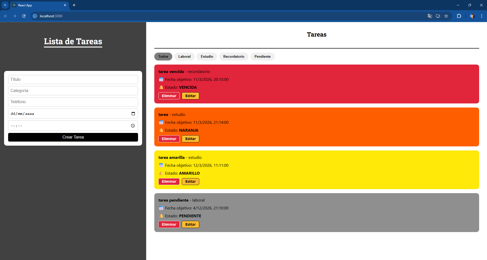

## Screenshots

# Task Manager with WhatsApp Notifications

Web application for task management developed using the MERN stack (MongoDB, Express, React, Node.js).

The system automatically updates task priority based on the remaining time before the deadline and sends WhatsApp notifications to the user when the task status changes.

## Features

- Create, edit and delete tasks
- Automatic status updates based on time remaining
- Visual priority system
- WhatsApp notifications using Twilio API
- Task tracking dashboard

## Task Status System

Tasks change color automatically depending on how close they are to their deadline:

- Green → More than 24 hours remaining
- Yellow → Less than 24 hours remaining
- Orange → Less than a few hours remaining
- Red → Task overdue

Each time a task changes status, the system sends a WhatsApp notification to the user informing them about the update.

## Technologies Used

- MongoDB
- Express
- React
- Node.js
- Twilio API

## Installation

Clone the repository:

git clone URL_DEL_REPO

Install dependencies for both frontend and backend:

npm install

Run the development servers:

npm run dev

## Screenshots

(Add screenshots here of the dashboard, task creation and task list)
